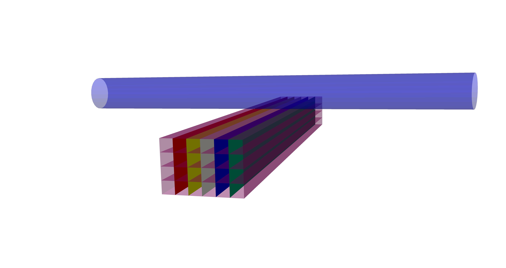

# Structural Optimization Benchmark Project

This repository contains a structural optimization benchmark project using OpenRadioss as solver.

## Overview

The structural optimization benchmark project aims to provide a framework for implementing and evaluating various structural optimization problems. It includes modules for defining optimization problems, generating finite element meshes, solving EFEM models, and post-processing results.

## Cases

### Starbox (Problem 1)

### Three-Point Bending (Problem 2)

### CrashTube (Problem 3)

## Project Structure

The project is structured as follows:

- `tests.py`: Containing multiple functions for checking the module functionality.
- `src/sob/`: The directory containing the core modules of the project.
  - `__init__.py`: Initializes the Python package.
  - `problems.py`: Defines optimization problem classes.
  - `fem.py`: Implements finite element analysis functionality.
  - `mesh.py`: Handles mesh generation and manipulation.
  - `solver.py`: A function to perform calls to OpenRadioss (starter and engine)
  - `post_processing.py`: Provides tools for post-processing FEM simulation results.
  - `utils/`: A directory containing utilities for setting up the simulations.
      - `run_openradioss`: Module which contains the class `RunOpenRadioss` which generates the commands to run OpenRadioss as well as external executables (`TH_TO_CSV`,`ANIM_TO_VTK`).
      - `solver_setup`: Contains the class `RunnerOptions`, which is an extension of a dictionary to set up the runs. The required keys of the dictionary to set up the cases are contained there.
  - `lib/`: A directory containing supplementary files and libraries.
      - `py_mesh.py`: A file with functions related to mesh generation (for starbox model). **Deprecated**
      - `py_mesh_v2.py`: Modified version of py_mesh_v2, trigger generation variables added (for crash tube model). **Deprecated**
      - `gmsh_base_meshes.py`: Contains a template or base class to generate objects that when used the `__call__` method, then a mesh by using GMSH framework is generated.
      - `starbox_gmsh.py`: A file with functions related to mesh generation (for starbox model) with GMSH framework.
      - `crashtube_gmsh.py`: A file with functions related to mesh generation (for crash tube model) with GMSH framework.
      - `three_point_bending_gmsh.py`: A file with functions related to mesh generation (for three point bending model) with GMSH framework.

## Instructions for Running OpenRadioss Solver
1. You should have OpenRadioss installed. About how to install it, see: https://github.com/OpenRadioss/OpenRadioss/blob/main/INSTALL.md. There's also an official YouTube video for building it from sourse code: https://www.youtube.com/watch?v=ddvH2CNfaYg&list=LL&index=4. You can either download the stable version or build the binaries yourself. You should have the tools `TH_TO_CSV` and `ANIM_TO_VTK` in the directory *../OpenRadioss/exec* as well as the starter and engine executables.
2. In the `main.py`, you should point the path to the OpenRadioss directory in order to run the code.
3. Have fun.

## Setting up cases

## Contact constributors
- Ivan Olarte Rodriguez (ivan.olarte.rodriguez@liacs.leidenuniv.nl) *Main Contact*
- Maria Laura Santoni (maria-laura.santoni@lip6.fr) *Main Contact*
- Elena Raponi (e.raponi@liacs.leidenuniv.nl)

## Other contributors
- Feifan Li (feifan.li@tum.de)

